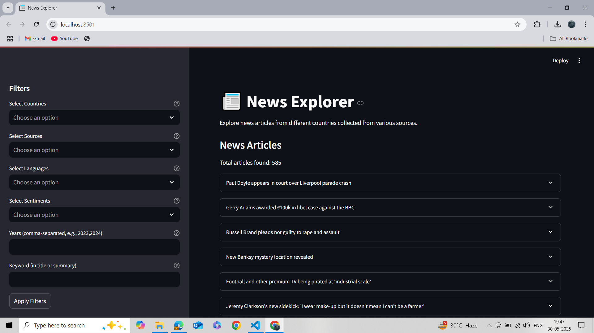
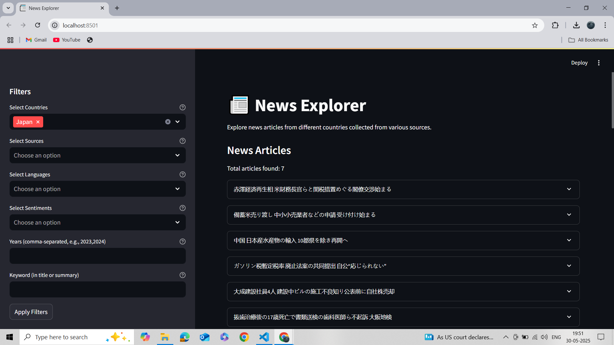
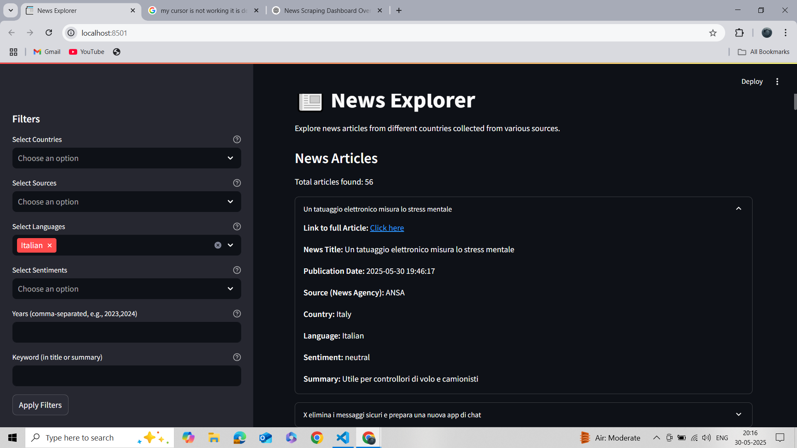
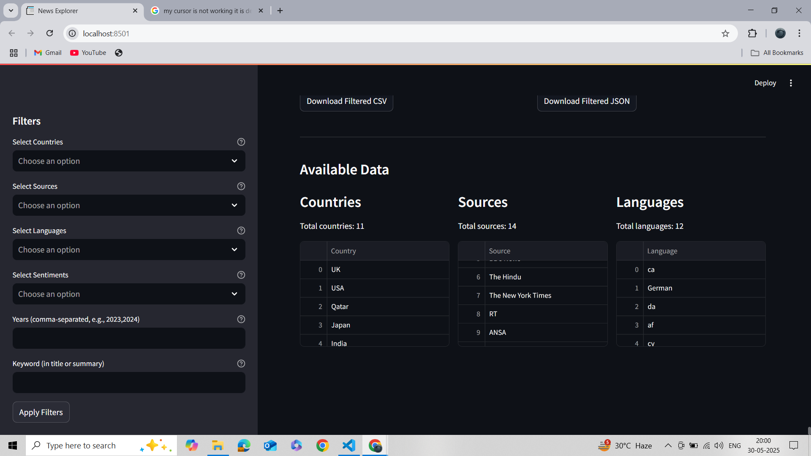
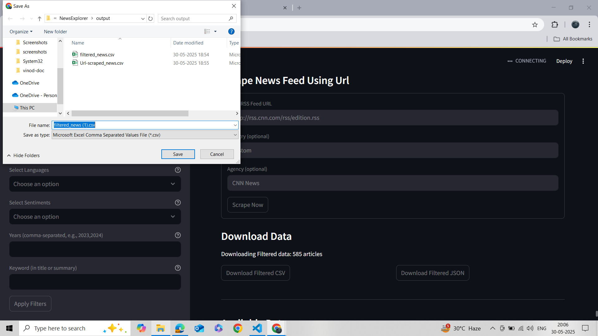
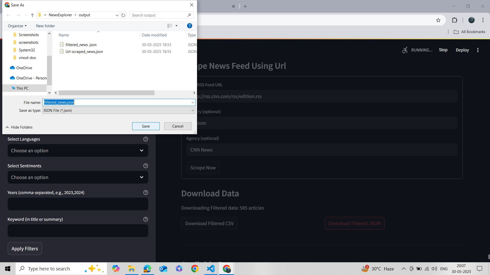

# 🗞️ News Explorer

**Web Scraping and Analysis of News Articles Using RSS Feeds**

## 🌍 Overview

**News Explorer** is a Python-based application designed to scrape, analyze, and visualize news articles from **24+ countries** using RSS feeds and historical article parsing. It combines a robust **FastAPI** backend with a user-friendly **Streamlit** frontend to provide an end-to-end solution for news aggregation and exploration. The project meets and exceeds the core requirements of the assignment by:

- Scraping news from **30+ news sources** across **24+ countries**.
- Using `feedparser` for RSS parsing and `BeautifulSoup4` for HTML-based historical article extraction.
- Handling missing data, encoding issues, and structural inconsistencies with robust error handling.
- Storing data in **SQLite**, **CSV**, and **JSON** formats with deduplication.
- Implementing **language detection** (`langdetect`) and **sentiment analysis** (`vaderSentiment`).
- Serving data through a **RESTful API** with FastAPI.
- Providing an interactive **Streamlit UI** for filtering, visualization, and live scraping.

This project is ideal for **researchers**, **journalists**, **data analysts**, or **developers** interested in media monitoring, multilingual sentiment analysis, or global news aggregation.

---

## 🚀 Features

### 🔍 Core Functionality
- **Multi-Country RSS Scraping**:
  - Scrapes articles from **30+ news agencies** (e.g., BBC, Al Jazeera, NHK, The Times of India) across **24+ countries** using `feedparser`.
  - Filters articles to include only those published within the last **365 days**.
- **Historical Article Parsing**:
  - Extracts metadata from historical URLs using `BeautifulSoup4` for articles not available in RSS feeds.
  - Captures fields like title, summary, and publication date.
- **Structured Data Extraction**:
  - Extracts: `Title`, `Publication Date`, `Source`, `Country`, `Summary`, `URL`, `Language`, `Sentiment`.
  - Handles missing data with defaults (e.g., "No Title", "Unknown") and fallback parsing strategies.
- **Error Handling**:
  - Manages inconsistent RSS feed structures, encoding issues, and network errors with retries and logging.

### 🧠 Intelligence
- **Language Detection**:
  - Uses `langdetect` to identify article languages (e.g., `en` for English, `hi` for Hindi, `ja` for Japanese).
  - Ensures reliable detection with minimum text length checks.
- **Sentiment Analysis**:
  - Analyzes article summaries using `vaderSentiment` to classify sentiment as `positive`, `negative`, `neutral`, or `unknown`.

### 💾 Data Storage
- **SQLite Database**:
  - Stores articles in `news_data.db` with a schema enforcing unique constraints on `title`, `publication_date`, `source`, and `url`.
- **CSV and JSON Exports**:
  - Saves data to `downloads/news_data.csv` and `downloads/news_data.json` for portability and analysis.
- **Deduplication**:
  - Removes duplicate articles based on `title`, `source`, and `url`.

### 🌐 FastAPI Backend
- Provides **RESTful endpoints** for querying, filtering, and scraping news.
- Supports dynamic filtering by country, source, language, sentiment, year, and keywords.
- Handles custom RSS feed scraping via API.

### 📊 Streamlit Frontend
- **Interactive UI**:
  - Filter articles by country, source, language, sentiment, year, or keyword.
  - Display articles as expandable cards with metadata and links.
- **Visualizations**:
  - Plotly charts for articles by country (bar), language (pie), and sentiment (bar).
- **Live Scraping**:
  - Scrape new RSS feeds directly from the UI.
- **Data Export**:
  - Download filtered or scraped data as CSV or JSON.

### ⏰ Automation
- **Scheduled Scraping**:
  - Uses `apscheduler` to scrape all feeds every **4 hours**.
- **Parallel Processing**:
  - Scrapes multiple feeds concurrently using `concurrent.futures.ThreadPoolExecutor`.

---

## 🧩 Architecture Overview

```plaintext
news-explorer/
├── backend.py           # FastAPI backend script
├── frontend.py          # Streamlit frontend script
├── news_data.db         # SQLite database
├── downloads/           # Output directory
│   ├── news_data.csv    # Scraped articles in CSV
│   ├── news_data.json   # Scraped articles in JSON
├── screenshots/         # Screenshots for documentation
├── news_scraper.log     # Log file for scraping events
├── requirements.txt     # Python dependencies
├── README.md            # Project documentation
```

---

## 📡 API Endpoints

| Endpoint            | Method | Description                                           | Example Payload/Response                              |
|---------------------|--------|-------------------------------------------------------|-------------------------------------------------------|
| `/news`             | GET    | Retrieve all articles                                 | `[{title: "...", country: "UK", ...}, ...]`           |
| `/news/filter`      | POST   | Filter by criteria                                    | `{"country": "India,UK", "language": "en,hi"}`        |
| `/news/scrape`      | POST   | Scrape a custom RSS feed                              | `{"rss_url": "https://example.com/rss", "country": "Custom"}` |
| `/news/scrape_all`  | GET    | Scrape all configured feeds                           | `{"message": "Scraping completed"}`                   |
| `/news/countries`   | GET    | List unique countries                                 | `["UK", "USA", "India", ...]`                         |
| `/news/sources`     | GET    | List unique news sources                              | `["BBC News", "Al Jazeera", ...]`                     |
| `/news/languages`   | GET    | List detected languages                               | `["en", "hi", "ja", ...]`                             |
| `/news/sentiments`  | GET    | List sentiment labels                                 | `["positive", "negative", "neutral", "unknown"]`      |
| `/news/years`       | GET    | List publication years                                | `["2023", "2024", "2025"]`                            |

---

## 🔧 Installation

### 🔁 Prerequisites
- **Python 3.8+**: Ensure Python is installed (`python --version`).
- **Git**: For cloning the repository (`git --version`).
- **Internet Connection**: Required for scraping RSS feeds and historical URLs.

### 📥 Clone the Repository
```bash
git clone https://github.com/yourusername/news-explorer.git
cd news-explorer
```

*Note*: Replace `yourusername` with your actual GitHub username or use the correct repository URL.

### 📦 Install Dependencies
Install all required Python libraries directly in your global environment:

```bash
pip install feedparser pandas requests beautifulsoup4 langdetect vaderSentiment fastapi uvicorn streamlit plotly apscheduler
```

To ensure all dependencies are installed correctly, you can use a `requirements.txt` file (see below).

---

## 🛠️ How to Run the Application

###  📦 Install Dependencies

Install dependencies using:
```bash
pip install -r requirements.txt
```

### 1. Start the Backend (FastAPI)
1. Save the backend code as `backend.py`.
2. Open a terminal in the project directory.
3. Run the backend:
   ```bash
   python backend.py
   ```
   - Initializes the SQLite database (`news_data.db`).
   - Performs an initial scrape of all RSS feeds and historical URLs.
   - Saves data to `downloads/news_data.csv` and `downloads/news_data.json`.
   - Starts the FastAPI server at `http://localhost:8000`.
   - Schedules scraping every **4 hours**.

### 2. Launch the Frontend (Streamlit)
1. Save the frontend code as `frontend.py`.
2. Open a new terminal in the project directory.
3. Run the Streamlit app:
   ```bash
   streamlit run frontend.py
   ```
   - Opens the UI in your default browser at `http://localhost:8501`.
   - Allows filtering, visualization, live scraping, and data export.

### 3. Explore the Application
- **API Access**:
  - Use tools like `curl`, Postman, or the Streamlit UI to interact with endpoints (e.g., `http://localhost:8000/news`).
- **Streamlit UI**:
  - Filter articles by country, source, language, sentiment, year, or keyword.
  - View Plotly visualizations (articles by country, language, sentiment).
  - Scrape new RSS feeds via the "Scrape News Feed Using Url" form.
  - Download data as CSV or JSON.

---

## 🖼️ Screenshots

Here is the **screenshots section** rewritten to match your detailed feature descriptions and correctly reference the visuals:

---

## 📸 Screenshots

Find key UI features in the `screenshots/` directory:

1. ### 🏠 **Landing Page**

   Displays a sidebar with all filters and extracted news articles in the main section.
   

2. ### 🌍 **Country Filter**

   Filtering news articles by selecting specific countries and news sources.
   

3. ### 🗣️ **Language and Sentiment Filter**

   Refines the results by detecting article language and analyzing sentiment (positive, neutral, negative).
   

4. ### 📰 **Full Article Display**

   Expandable cards reveal complete article details including summary, source, language, and sentiment.
   

5. ### 📊 **Visualization of Filtered Data**

   Interactive Plotly charts for visual analysis of filtered articles by country, language, and sentiment.
   

6. ### 📈 **All Available Data Summary**

   

7. ### 🔗 **URL Scraping**

   Form input to scrape new RSS feed URLs and fetch live article data.
   

8. ### 📥 **Download CSV Format**

   

9. ### 🧾 **Download JSON Format**

   
  


## 📈 Sample Coverage

| Country       | News Agencies                | Approx. Articles | Historical Coverage |
|---------------|------------------------------|------------------|---------------------|
| UK            | BBC News, The Guardian       | ~50              | Since 2023          |
| USA           | CNN, The New York Times      | ~80              | Since 2023          |
| Japan         | NHK, The Japan Times         | ~30              | 2025                |
| India         | The Times of India, The Hindu| ~40              | 2025                |
| Qatar         | Al Jazeera                   | ~20              | 2025                |
| Germany       | Deutsche Welle               | ~25              | 2025                |
| France        | France 24                    | ~20              | 2025                |
| Brazil        | Folha de S.Paulo             | ~15              | 2025                |
| Russia        | RT                           | ~30              | 2025                |
| South Africa  | News24                       | ~15              | 2025                |

*Note*: Article counts vary based on feed availability, updates, and scraping frequency.

---

## 🧪 Troubleshooting

| Issue                                    | Solution                                                                 |
|------------------------------------------|-------------------------------------------------------------------------|
| **Backend fails to start**               | Check `news_scraper.log` for errors; ensure dependencies are installed.  |
| **Streamlit shows "No Data"**            | Verify backend is running at `http://localhost:8000`; check `news_data.db`. |
| **Only 'en' or 'unknown' languages**     | Delete `news_data.db` and rerun `backend.py` to scrape fresh data.       |
| **Invalid RSS feed URL**                 | Ensure URL ends with `.rss` or `.xml` (e.g., `https://example.com/rss`). |
| **Encoding errors**                      | Handled via `.encode('utf-8', errors='ignore')`; check logs for issues.  |
| **Streamlit cache issues**               | Clear cache with `streamlit cache clear`.                               |

---

## 🛣️ Roadmap

- **Expand Coverage**: Add more countries and RSS feeds (e.g., Southeast Asia, Middle East).
- **Advanced Filtering**: Support date ranges, multiple keywords, and regex-based searches.
- **Enhanced Visualizations**: Add time-series analysis, word clouds, and geographic heatmaps.
- **User Authentication**: Secure API endpoints with JWT or OAuth.
- **Deployment**: Containerize with Docker and deploy to cloud platforms (e.g., AWS, Heroku).
- **Full-Text Scraping**: Extract complete article content for deeper analysis.

---

## 📚 Assignment Deliverables

This project fulfills the following assignment requirements:

1. **Web Scraping**:
   - Scrapes **30+ news sources** across **24+ countries** using RSS feeds and historical URLs.
   - Uses `feedparser` for RSS and `BeautifulSoup4` for HTML parsing.
2. **Data Extraction**:
   - Extracts required fields: `Title`, `Publication Date`, `Source`, `Country`, `Summary`, `URL`, `Language`, `Sentiment`.
   - Handles missing data with defaults and fallback parsing.
3. **Data Storage**:
   - Stores data in **SQLite** (`news_data.db`) with unique constraints.
   - Exports to **CSV** and **JSON** in the `downloads/` directory.
4. **Language Detection**:
   - Implements `langdetect` to categorize articles by language (e.g., `en`, `hi`, `ja`).
5. **Sentiment Analysis**:
   - Uses `vaderSentiment` to classify article summaries.
6. **API Development**:
   - Provides a **FastAPI** backend with RESTful endpoints for querying and filtering.
7. **Frontend UI**:
   - Delivers a **Streamlit** interface for interactive exploration and visualization.
8. **Automation**:
   - Schedules scraping every **4 hours** using `apscheduler`.
9. **Error Handling**:
   - Manages encoding issues, network failures, and inconsistent feed structures.
10. **Documentation**:
    - Includes this README with setup instructions, screenshots, and troubleshooting.

### Bonus Features
- Parallel scraping with `concurrent.futures`.
- Interactive Plotly visualizations.
- Live RSS feed scraping via the UI.
- Sentiment-based filtering and analysis.
- Modular code structure with detailed comments.

---

## 📚 References & Documentation

- [FastAPI Documentation](https://fastapi.tiangolo.com/)
- [Streamlit Documentation](https://docs.streamlit.io/)
- [Feedparser Documentation](https://feedparser.readthedocs.io/)
- [BeautifulSoup4 Documentation](https://www.crummy.com/software/BeautifulSoup/bs4/doc/)
- [Langdetect Documentation](https://pypi.org/project/langdetect/)
- [VADER Sentiment Analysis](https://github.com/cjhutto/vaderSentiment)
- [APScheduler Documentation](https://apscheduler.readthedocs.io/)

---

## 📄 License

© 2025 **News Explorer**. All rights reserved.

---
